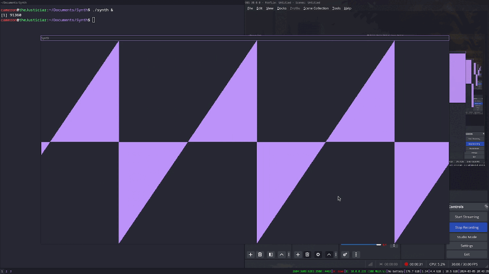

## Sawtooth Synth
This is a simple synth written in C++ using libSDL2 for audio and keybindings.

### controls
1. Q W E A S D F G H R T Y Z X C B N M J K L U I O for notes.
2. Left and right arrow keys to change generated waveform.

### todo
1. implement some form of ADSR.

